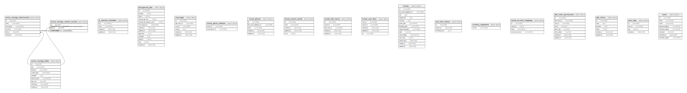

# school_of_movie_api_test

## Tables

| Name | Columns | Comment | Type |
| ---- | ------- | ------- | ---- |
| [active_storage_attachments](active_storage_attachments.md) | 6 |  | BASE TABLE |
| [active_storage_blobs](active_storage_blobs.md) | 9 |  | BASE TABLE |
| [active_storage_variant_records](active_storage_variant_records.md) | 3 |  | BASE TABLE |
| [ar_internal_metadata](ar_internal_metadata.md) | 4 |  | BASE TABLE |
| [background_jobs](background_jobs.md) | 13 |  | BASE TABLE |
| [messages](messages.md) | 6 |  | BASE TABLE |
| [movie_genre_relations](movie_genre_relations.md) | 2 |  | BASE TABLE |
| [movie_genres](movie_genres.md) | 5 |  | BASE TABLE |
| [movie_search_words](movie_search_words.md) | 5 |  | BASE TABLE |
| [movie_talk_rooms](movie_talk_rooms.md) | 5 |  | BASE TABLE |
| [movie_user_likes](movie_user_likes.md) | 5 |  | BASE TABLE |
| [movies](movies.md) | 14 |  | BASE TABLE |
| [one_time_tokens](one_time_tokens.md) | 3 |  | BASE TABLE |
| [schema_migrations](schema_migrations.md) | 1 |  | BASE TABLE |
| [social_account_mappings](social_account_mappings.md) | 4 |  | BASE TABLE |
| [talk_room_permissions](talk_room_permissions.md) | 8 |  | BASE TABLE |
| [talk_rooms](talk_rooms.md) | 6 |  | BASE TABLE |
| [user_tags](user_tags.md) | 4 |  | BASE TABLE |
| [users](users.md) | 8 |  | BASE TABLE |

## Relations

---

> Generated by [tbls](https://github.com/k1LoW/tbls)
