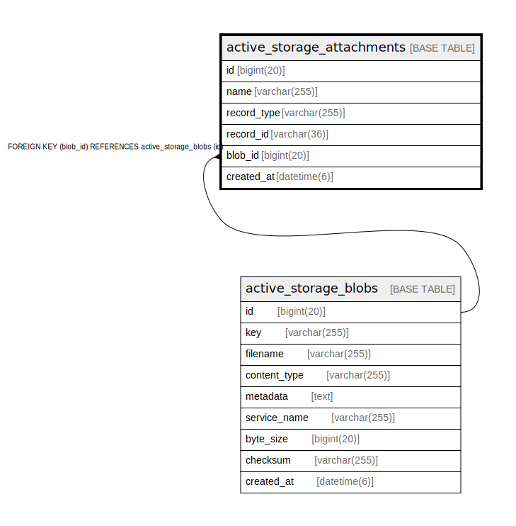

# active_storage_attachments

## Description

<details>
<summary><strong>Table Definition</strong></summary>

```sql
CREATE TABLE `active_storage_attachments` (
  `id` bigint(20) NOT NULL AUTO_INCREMENT,
  `name` varchar(255) NOT NULL,
  `record_type` varchar(255) NOT NULL,
  `record_id` varchar(36) NOT NULL,
  `blob_id` bigint(20) NOT NULL,
  `created_at` datetime(6) NOT NULL,
  PRIMARY KEY (`id`),
  UNIQUE KEY `index_active_storage_attachments_uniqueness` (`record_type`,`record_id`,`name`,`blob_id`),
  KEY `index_active_storage_attachments_on_blob_id` (`blob_id`),
  CONSTRAINT `fk_rails_c3b3935057` FOREIGN KEY (`blob_id`) REFERENCES `active_storage_blobs` (`id`)
) ENGINE=InnoDB DEFAULT CHARSET=utf8mb4
```

</details>

## Columns

| Name | Type | Default | Nullable | Extra Definition | Children | Parents | Comment |
| ---- | ---- | ------- | -------- | ---------------- | -------- | ------- | ------- |
| id | bigint(20) |  | false | auto_increment |  |  |  |
| name | varchar(255) |  | false |  |  |  |  |
| record_type | varchar(255) |  | false |  |  |  |  |
| record_id | varchar(36) |  | false |  |  |  |  |
| blob_id | bigint(20) |  | false |  |  | [active_storage_blobs](active_storage_blobs.md) |  |
| created_at | datetime(6) |  | false |  |  |  |  |

## Constraints

| Name | Type | Definition |
| ---- | ---- | ---------- |
| fk_rails_c3b3935057 | FOREIGN KEY | FOREIGN KEY (blob_id) REFERENCES active_storage_blobs (id) |
| index_active_storage_attachments_uniqueness | UNIQUE | UNIQUE KEY index_active_storage_attachments_uniqueness (record_type, record_id, name, blob_id) |
| PRIMARY | PRIMARY KEY | PRIMARY KEY (id) |

## Indexes

| Name | Definition |
| ---- | ---------- |
| index_active_storage_attachments_on_blob_id | KEY index_active_storage_attachments_on_blob_id (blob_id) USING BTREE |
| PRIMARY | PRIMARY KEY (id) USING BTREE |
| index_active_storage_attachments_uniqueness | UNIQUE KEY index_active_storage_attachments_uniqueness (record_type, record_id, name, blob_id) USING BTREE |

## Relations



---

> Generated by [tbls](https://github.com/k1LoW/tbls)
