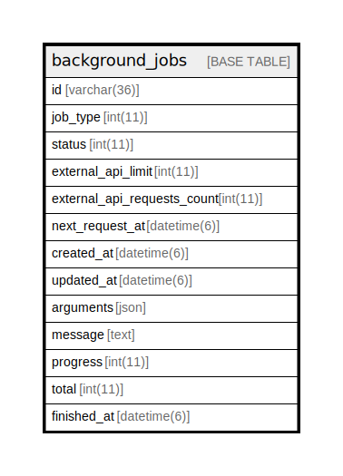

# background_jobs

## Description

<details>
<summary><strong>Table Definition</strong></summary>

```sql
CREATE TABLE `background_jobs` (
  `id` varchar(36) NOT NULL,
  `job_type` int(11) DEFAULT NULL,
  `status` int(11) DEFAULT NULL,
  `external_api_limit` int(11) DEFAULT NULL,
  `external_api_requests_count` int(11) DEFAULT '0',
  `next_request_at` datetime(6) DEFAULT NULL,
  `created_at` datetime(6) NOT NULL,
  `updated_at` datetime(6) NOT NULL,
  `arguments` json DEFAULT NULL,
  `message` text,
  `progress` int(11) DEFAULT NULL,
  `total` int(11) DEFAULT NULL,
  `finished_at` datetime(6) DEFAULT NULL,
  PRIMARY KEY (`id`),
  KEY `index_background_jobs_on_job_type_and_query` (`job_type`),
  KEY `index_background_jobs_on_job_type` (`job_type`)
) ENGINE=InnoDB DEFAULT CHARSET=utf8mb4
```

</details>

## Columns

| Name | Type | Default | Nullable | Children | Parents | Comment |
| ---- | ---- | ------- | -------- | -------- | ------- | ------- |
| id | varchar(36) |  | false |  |  |  |
| job_type | int(11) |  | true |  |  |  |
| status | int(11) |  | true |  |  |  |
| external_api_limit | int(11) |  | true |  |  |  |
| external_api_requests_count | int(11) | 0 | true |  |  |  |
| next_request_at | datetime(6) |  | true |  |  |  |
| created_at | datetime(6) |  | false |  |  |  |
| updated_at | datetime(6) |  | false |  |  |  |
| arguments | json |  | true |  |  |  |
| message | text |  | true |  |  |  |
| progress | int(11) |  | true |  |  |  |
| total | int(11) |  | true |  |  |  |
| finished_at | datetime(6) |  | true |  |  |  |

## Constraints

| Name | Type | Definition |
| ---- | ---- | ---------- |
| PRIMARY | PRIMARY KEY | PRIMARY KEY (id) |

## Indexes

| Name | Definition |
| ---- | ---------- |
| index_background_jobs_on_job_type | KEY index_background_jobs_on_job_type (job_type) USING BTREE |
| index_background_jobs_on_job_type_and_query | KEY index_background_jobs_on_job_type_and_query (job_type) USING BTREE |
| PRIMARY | PRIMARY KEY (id) USING BTREE |

## Relations



---

> Generated by [tbls](https://github.com/k1LoW/tbls)
