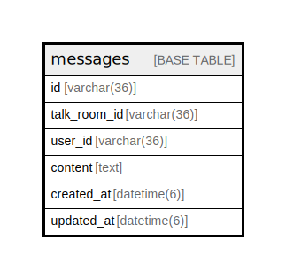

# messages

## Description

<details>
<summary><strong>Table Definition</strong></summary>

```sql
CREATE TABLE `messages` (
  `id` varchar(36) NOT NULL,
  `talk_room_id` varchar(36) NOT NULL,
  `user_id` varchar(36) NOT NULL,
  `content` text COMMENT 'メッセージ内容',
  `created_at` datetime(6) DEFAULT NULL,
  `updated_at` datetime(6) DEFAULT NULL,
  PRIMARY KEY (`id`),
  KEY `index_messages_on_talk_room_id` (`talk_room_id`)
) ENGINE=InnoDB DEFAULT CHARSET=utf8mb4
```

</details>

## Columns

| Name | Type | Default | Nullable | Children | Parents | Comment |
| ---- | ---- | ------- | -------- | -------- | ------- | ------- |
| id | varchar(36) |  | false |  |  |  |
| talk_room_id | varchar(36) |  | false |  |  |  |
| user_id | varchar(36) |  | false |  |  |  |
| content | text |  | true |  |  | メッセージ内容 |
| created_at | datetime(6) |  | true |  |  |  |
| updated_at | datetime(6) |  | true |  |  |  |

## Constraints

| Name | Type | Definition |
| ---- | ---- | ---------- |
| PRIMARY | PRIMARY KEY | PRIMARY KEY (id) |

## Indexes

| Name | Definition |
| ---- | ---------- |
| index_messages_on_talk_room_id | KEY index_messages_on_talk_room_id (talk_room_id) USING BTREE |
| PRIMARY | PRIMARY KEY (id) USING BTREE |

## Relations



---

> Generated by [tbls](https://github.com/k1LoW/tbls)
