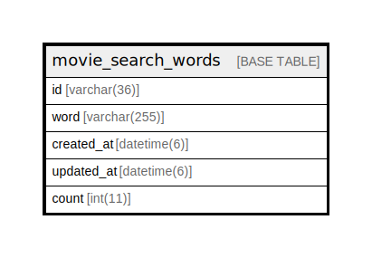

# movie_search_words

## Description

<details>
<summary><strong>Table Definition</strong></summary>

```sql
CREATE TABLE `movie_search_words` (
  `id` varchar(36) NOT NULL,
  `word` varchar(255) DEFAULT NULL,
  `created_at` datetime(6) NOT NULL,
  `updated_at` datetime(6) NOT NULL,
  `count` int(11) DEFAULT NULL,
  PRIMARY KEY (`id`),
  KEY `index_movie_search_words_on_word` (`word`)
) ENGINE=InnoDB DEFAULT CHARSET=utf8mb4
```

</details>

## Columns

| Name | Type | Default | Nullable | Children | Parents | Comment |
| ---- | ---- | ------- | -------- | -------- | ------- | ------- |
| id | varchar(36) |  | false |  |  |  |
| word | varchar(255) |  | true |  |  |  |
| created_at | datetime(6) |  | false |  |  |  |
| updated_at | datetime(6) |  | false |  |  |  |
| count | int(11) |  | true |  |  |  |

## Constraints

| Name | Type | Definition |
| ---- | ---- | ---------- |
| PRIMARY | PRIMARY KEY | PRIMARY KEY (id) |

## Indexes

| Name | Definition |
| ---- | ---------- |
| index_movie_search_words_on_word | KEY index_movie_search_words_on_word (word) USING BTREE |
| PRIMARY | PRIMARY KEY (id) USING BTREE |

## Relations



---

> Generated by [tbls](https://github.com/k1LoW/tbls)
