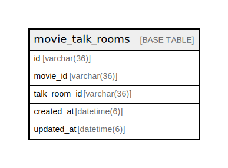

# movie_talk_rooms

## Description

<details>
<summary><strong>Table Definition</strong></summary>

```sql
CREATE TABLE `movie_talk_rooms` (
  `id` varchar(36) NOT NULL,
  `movie_id` varchar(36) NOT NULL COMMENT '映画ID',
  `talk_room_id` varchar(36) NOT NULL COMMENT 'トークルームID',
  `created_at` datetime(6) NOT NULL,
  `updated_at` datetime(6) NOT NULL,
  PRIMARY KEY (`id`),
  UNIQUE KEY `index_movie_talk_rooms_on_movie_id_and_talk_room_id` (`movie_id`,`talk_room_id`),
  UNIQUE KEY `index_movie_talk_rooms_on_movie_id` (`movie_id`)
) ENGINE=InnoDB DEFAULT CHARSET=utf8mb4
```

</details>

## Columns

| Name | Type | Default | Nullable | Children | Parents | Comment |
| ---- | ---- | ------- | -------- | -------- | ------- | ------- |
| id | varchar(36) |  | false |  |  |  |
| movie_id | varchar(36) |  | false |  |  | 映画ID |
| talk_room_id | varchar(36) |  | false |  |  | トークルームID |
| created_at | datetime(6) |  | false |  |  |  |
| updated_at | datetime(6) |  | false |  |  |  |

## Constraints

| Name | Type | Definition |
| ---- | ---- | ---------- |
| index_movie_talk_rooms_on_movie_id | UNIQUE | UNIQUE KEY index_movie_talk_rooms_on_movie_id (movie_id) |
| index_movie_talk_rooms_on_movie_id_and_talk_room_id | UNIQUE | UNIQUE KEY index_movie_talk_rooms_on_movie_id_and_talk_room_id (movie_id, talk_room_id) |
| PRIMARY | PRIMARY KEY | PRIMARY KEY (id) |

## Indexes

| Name | Definition |
| ---- | ---------- |
| PRIMARY | PRIMARY KEY (id) USING BTREE |
| index_movie_talk_rooms_on_movie_id | UNIQUE KEY index_movie_talk_rooms_on_movie_id (movie_id) USING BTREE |
| index_movie_talk_rooms_on_movie_id_and_talk_room_id | UNIQUE KEY index_movie_talk_rooms_on_movie_id_and_talk_room_id (movie_id, talk_room_id) USING BTREE |

## Relations



---

> Generated by [tbls](https://github.com/k1LoW/tbls)
