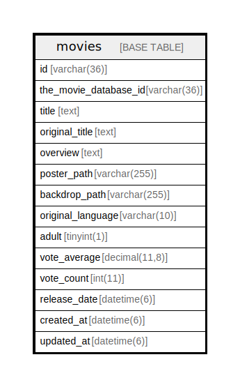

# movies

## Description

<details>
<summary><strong>Table Definition</strong></summary>

```sql
CREATE TABLE `movies` (
  `id` varchar(36) NOT NULL,
  `the_movie_database_id` varchar(36) NOT NULL COMMENT 'tmdbで管理されているid',
  `title` text NOT NULL COMMENT 'タイトル',
  `original_title` text NOT NULL COMMENT '原題',
  `overview` text NOT NULL COMMENT '概要',
  `poster_path` varchar(255) DEFAULT NULL COMMENT 'ポスター画像パス',
  `backdrop_path` varchar(255) DEFAULT NULL COMMENT '背景画像パス',
  `original_language` varchar(10) NOT NULL COMMENT '言語',
  `adult` tinyint(1) NOT NULL COMMENT '成人向け',
  `vote_average` decimal(11,8) DEFAULT NULL COMMENT '平均評価',
  `vote_count` int(11) DEFAULT NULL COMMENT '評価数',
  `release_date` datetime(6) DEFAULT NULL COMMENT '公開日',
  `created_at` datetime(6) NOT NULL,
  `updated_at` datetime(6) NOT NULL,
  PRIMARY KEY (`id`),
  UNIQUE KEY `index_movies_on_the_movie_database_id` (`the_movie_database_id`)
) ENGINE=InnoDB DEFAULT CHARSET=utf8mb4
```

</details>

## Columns

| Name | Type | Default | Nullable | Children | Parents | Comment |
| ---- | ---- | ------- | -------- | -------- | ------- | ------- |
| id | varchar(36) |  | false |  |  |  |
| the_movie_database_id | varchar(36) |  | false |  |  | tmdbで管理されているid |
| title | text |  | false |  |  | タイトル |
| original_title | text |  | false |  |  | 原題 |
| overview | text |  | false |  |  | 概要 |
| poster_path | varchar(255) |  | true |  |  | ポスター画像パス |
| backdrop_path | varchar(255) |  | true |  |  | 背景画像パス |
| original_language | varchar(10) |  | false |  |  | 言語 |
| adult | tinyint(1) |  | false |  |  | 成人向け |
| vote_average | decimal(11,8) |  | true |  |  | 平均評価 |
| vote_count | int(11) |  | true |  |  | 評価数 |
| release_date | datetime(6) |  | true |  |  | 公開日 |
| created_at | datetime(6) |  | false |  |  |  |
| updated_at | datetime(6) |  | false |  |  |  |

## Constraints

| Name | Type | Definition |
| ---- | ---- | ---------- |
| index_movies_on_the_movie_database_id | UNIQUE | UNIQUE KEY index_movies_on_the_movie_database_id (the_movie_database_id) |
| PRIMARY | PRIMARY KEY | PRIMARY KEY (id) |

## Indexes

| Name | Definition |
| ---- | ---------- |
| PRIMARY | PRIMARY KEY (id) USING BTREE |
| index_movies_on_the_movie_database_id | UNIQUE KEY index_movies_on_the_movie_database_id (the_movie_database_id) USING BTREE |

## Relations



---

> Generated by [tbls](https://github.com/k1LoW/tbls)
