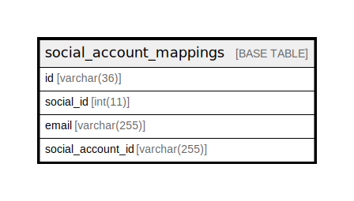

# social_account_mappings

## Description

<details>
<summary><strong>Table Definition</strong></summary>

```sql
CREATE TABLE `social_account_mappings` (
  `id` varchar(36) NOT NULL,
  `social_id` int(11) NOT NULL COMMENT 'SNSのID',
  `email` varchar(255) NOT NULL,
  `social_account_id` varchar(255) NOT NULL COMMENT '連携するSNSのユーザID',
  PRIMARY KEY (`id`),
  UNIQUE KEY `index_social_account_mappings_on_social_id_and_email` (`social_id`,`email`)
) ENGINE=InnoDB DEFAULT CHARSET=utf8mb4
```

</details>

## Columns

| Name | Type | Default | Nullable | Children | Parents | Comment |
| ---- | ---- | ------- | -------- | -------- | ------- | ------- |
| id | varchar(36) |  | false |  |  |  |
| social_id | int(11) |  | false |  |  | SNSのID |
| email | varchar(255) |  | false |  |  |  |
| social_account_id | varchar(255) |  | false |  |  | 連携するSNSのユーザID |

## Constraints

| Name | Type | Definition |
| ---- | ---- | ---------- |
| index_social_account_mappings_on_social_id_and_email | UNIQUE | UNIQUE KEY index_social_account_mappings_on_social_id_and_email (social_id, email) |
| PRIMARY | PRIMARY KEY | PRIMARY KEY (id) |

## Indexes

| Name | Definition |
| ---- | ---------- |
| PRIMARY | PRIMARY KEY (id) USING BTREE |
| index_social_account_mappings_on_social_id_and_email | UNIQUE KEY index_social_account_mappings_on_social_id_and_email (social_id, email) USING BTREE |

## Relations



---

> Generated by [tbls](https://github.com/k1LoW/tbls)
