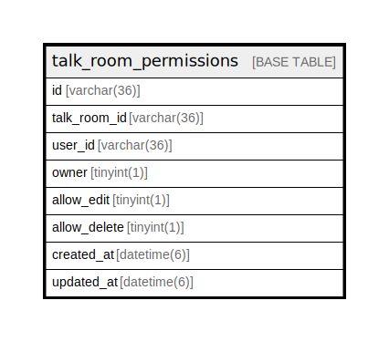

# talk_room_permissions

## Description

<details>
<summary><strong>Table Definition</strong></summary>

```sql
CREATE TABLE `talk_room_permissions` (
  `id` varchar(36) NOT NULL,
  `talk_room_id` varchar(36) NOT NULL,
  `user_id` varchar(36) NOT NULL,
  `owner` tinyint(1) DEFAULT '0' COMMENT 'トークルームのオーナー権限（オーナー、変更、削除権限を変更できる）',
  `allow_edit` tinyint(1) DEFAULT '0' COMMENT 'トークルームの変更権限',
  `allow_delete` tinyint(1) DEFAULT '0' COMMENT 'トークルームの削除権限',
  `created_at` datetime(6) DEFAULT NULL,
  `updated_at` datetime(6) DEFAULT NULL,
  PRIMARY KEY (`id`),
  UNIQUE KEY `index_talk_room_permissions_on_talk_room_id_and_user_id` (`talk_room_id`,`user_id`)
) ENGINE=InnoDB DEFAULT CHARSET=utf8mb4
```

</details>

## Columns

| Name | Type | Default | Nullable | Children | Parents | Comment |
| ---- | ---- | ------- | -------- | -------- | ------- | ------- |
| id | varchar(36) |  | false |  |  |  |
| talk_room_id | varchar(36) |  | false |  |  |  |
| user_id | varchar(36) |  | false |  |  |  |
| owner | tinyint(1) | 0 | true |  |  | トークルームのオーナー権限（オーナー、変更、削除権限を変更できる） |
| allow_edit | tinyint(1) | 0 | true |  |  | トークルームの変更権限 |
| allow_delete | tinyint(1) | 0 | true |  |  | トークルームの削除権限 |
| created_at | datetime(6) |  | true |  |  |  |
| updated_at | datetime(6) |  | true |  |  |  |

## Constraints

| Name | Type | Definition |
| ---- | ---- | ---------- |
| index_talk_room_permissions_on_talk_room_id_and_user_id | UNIQUE | UNIQUE KEY index_talk_room_permissions_on_talk_room_id_and_user_id (talk_room_id, user_id) |
| PRIMARY | PRIMARY KEY | PRIMARY KEY (id) |

## Indexes

| Name | Definition |
| ---- | ---------- |
| PRIMARY | PRIMARY KEY (id) USING BTREE |
| index_talk_room_permissions_on_talk_room_id_and_user_id | UNIQUE KEY index_talk_room_permissions_on_talk_room_id_and_user_id (talk_room_id, user_id) USING BTREE |

## Relations



---

> Generated by [tbls](https://github.com/k1LoW/tbls)
