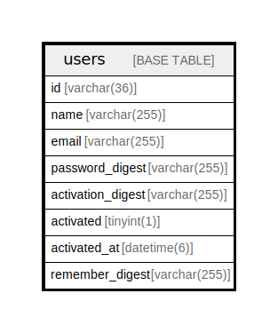

# users

## Description

<details>
<summary><strong>Table Definition</strong></summary>

```sql
CREATE TABLE `users` (
  `id` varchar(36) NOT NULL,
  `name` varchar(255) DEFAULT NULL,
  `email` varchar(255) DEFAULT NULL,
  `password_digest` varchar(255) DEFAULT NULL,
  `activation_digest` varchar(255) DEFAULT NULL,
  `activated` tinyint(1) DEFAULT '0',
  `activated_at` datetime(6) DEFAULT NULL,
  `remember_digest` varchar(255) DEFAULT NULL,
  PRIMARY KEY (`id`),
  UNIQUE KEY `index_users_on_email` (`email`)
) ENGINE=InnoDB DEFAULT CHARSET=utf8mb4
```

</details>

## Columns

| Name | Type | Default | Nullable | Children | Parents | Comment |
| ---- | ---- | ------- | -------- | -------- | ------- | ------- |
| id | varchar(36) |  | false |  |  |  |
| name | varchar(255) |  | true |  |  |  |
| email | varchar(255) |  | true |  |  |  |
| password_digest | varchar(255) |  | true |  |  |  |
| activation_digest | varchar(255) |  | true |  |  |  |
| activated | tinyint(1) | 0 | true |  |  |  |
| activated_at | datetime(6) |  | true |  |  |  |
| remember_digest | varchar(255) |  | true |  |  |  |

## Constraints

| Name | Type | Definition |
| ---- | ---- | ---------- |
| index_users_on_email | UNIQUE | UNIQUE KEY index_users_on_email (email) |
| PRIMARY | PRIMARY KEY | PRIMARY KEY (id) |

## Indexes

| Name | Definition |
| ---- | ---------- |
| PRIMARY | PRIMARY KEY (id) USING BTREE |
| index_users_on_email | UNIQUE KEY index_users_on_email (email) USING BTREE |

## Relations



---

> Generated by [tbls](https://github.com/k1LoW/tbls)
